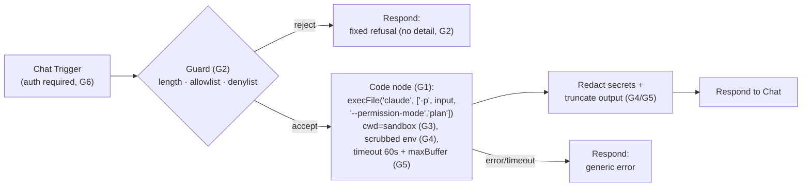

# Spec — Claude Code CLI ↔ n8n chat bridge

> Source of truth for the **Claude↔n8n chat bridge** (n8n-loop Epic B). An n8n workflow that takes
> chat input, runs it through `claude -p` (Claude Code CLI headless), and returns the reply to chat.
> **Status:** `draft` (B-1 spec). **SAFE mode:** authored + validated only — **NOT deployed, NOT
> active** until `apply_mode=1` (B-3). Created 2026-06-05.
>
> Owning backlog items: **B-1** (this spec) · **B-2** (author + `validate_workflow` JSON, no deploy)
> · **B-3 (APPLY)** (deploy to local n8n + smoke a chat round-trip).

## 1. Why this is dangerous (threat model first)
This bridge takes **untrusted chat text** and feeds it to a process that can **read/write files and
run code** (`claude -p` with tools). That is a remote-code-execution surface by construction. The
spec therefore designs the **guardrails before the happy path**. The defended assets: the host
filesystem, secrets (API keys, `.env`, `settings.local.json`), and the shell itself.

Primary threats:
| # | Threat | Vector |
|---|--------|--------|
| T1 | **Shell injection** | `{{chatInput}}` interpolated into a shell string → `; rm -rf ~`, `$(...)`, backticks, `&&`, pipes |
| T2 | **Filesystem escape** | claude told to read/write outside an allowed dir (`~/.ssh`, `../`, absolute paths) |
| T3 | **Secret exfiltration** | prompt asks claude to print env/API keys and return them in the chat reply |
| T4 | **Resource exhaustion / hang** | long-running or infinite agent loop; huge output |
| T5 | **Unauthorized access** | anyone who can reach the chat webhook can run the agent |
| T6 | **Tool/privilege escalation** | claude uses Bash/Write tools or `--dangerously-skip-permissions` |

## 2. Guardrails (REQUIRED — every one is a gate, not a nice-to-have)

### G1 — No shell string interpolation (defeats T1)
- **NEVER** build a shell command by concatenating `{{chatInput}}`. The naive
  `Execute Command: claude -p "{{chatInput}}"` is **forbidden** — n8n expression interpolation pastes
  raw text into the command string.
- **Required mechanism:** a **Code node** that calls `child_process.execFile('claude', ['-p', input, ...flags])`
  — an **argv array**, never `exec`/a shell string. `execFile` does not spawn a shell, so metacharacters
  in `input` are inert (passed as one literal argv element). Equivalent: pass the prompt over **stdin**
  (`claude -p` reading from stdin) rather than as an argument at all.
- If the Execute Command node must be used instead of Code, the input goes via an **environment
  variable** the node sets (`CHAT_INPUT`) and the command references `"$CHAT_INPUT"` **single-quoted
  at author time** — but the Code+`execFile` path is the spec's default because it removes the shell
  entirely.

### G2 — Input allowlist + rejection (defeats T1, narrows T2/T3)
A **Guard** step (IF/Code) runs **before** execution and **fails closed**:
- **Length cap:** reject input > `N` chars (default **2000**).
- **Charset allowlist:** accept only `[A-Za-z0-9 _.,:;!?@/#%()'"\n-]` (configurable); reject anything
  containing shell metacharacters `` ; | & $ ` \ < > ( ) { } `` when the Execute-Command fallback is in
  use. (Under the `execFile` default these are harmless, but the allowlist is still applied as
  defense-in-depth and to keep prompts sane.)
- **Deny-list phrases** (case-insensitive): `rm -rf`, `/etc/`, `~/.ssh`, `.env`, `secret`, `token`,
  `password`, `--dangerously`, `sudo`, `curl`, `wget`, `ssh`, `> /`, `base64`. A match → reject with a
  generic message (no detail leak).
- On reject: short-circuit to Respond with a fixed refusal string; **do not** run claude.

### G3 — Working-directory confinement (defeats T2)
- Run with `cwd` = a dedicated **sandbox dir** (default `~/.n8n-claude-bridge/sandbox`, created empty),
  **never** the repo or `$HOME`.
- Pass `--add-dir` **nothing** beyond the sandbox; rely on Claude Code's default of confining file
  access to the working dir. Explicitly **do not** pass `--add-dir ~` or absolute roots.
- Set a minimal `env` for the child (G4) so `cwd`-relative `../` traversal has nothing valuable above it.

### G4 — Minimal privilege & no secret passthrough (defeats T3, T6)
- Child process gets a **scrubbed env**: only `PATH`, `HOME`=sandbox, and the single
  `ANTHROPIC_API_KEY` (or the configured auth) — **strip everything else** (no `N8N_*`, no
  `*_TOKEN`, no `settings.local.json` contents).
- **Tool restriction:** invoke claude with the **least-privilege** flag set. Default to a
  read-only/answer-only profile: `--permission-mode plan` (or an equivalent allowed-tools allowlist
  that excludes Bash/Write/Edit). **NEVER** `--dangerously-skip-permissions`.
- Output is **scanned** before returning: redact anything matching a secret pattern
  (`sk-`, `ghp_`, `AKIA`, `-----BEGIN`, 32+ hex/base64 runs) → replace with `[redacted]`.

### G5 — Timeout & output cap (defeats T4)
- Hard wall-clock **timeout** (default **60s**) via `execFile`'s `timeout` option (sends SIGTERM) +
  a `timeout 75 claude …` belt-and-suspenders if shelling out. On timeout → kill, Respond with a
  generic "timed out" message.
- **maxBuffer** cap on child output (default **1 MB**); truncate the reply to **~4000 chars** before
  Respond.
- **Single-turn only:** `claude -p` (print mode, no interactive session, no resume) so there is no
  long-lived agent loop.

### G6 — Authentication on the trigger (defeats T5)
- The **Chat Trigger** must require auth: n8n chat `authentication` set to a shared **token/basic
  auth**, not public. Document the credential; do not hardcode.
- Bridge is **inactive by default**; only the operator activates it (and only in APPLY).

### G7 — SAFE-mode kill switch (loop discipline)
- In `apply_mode=0` the workflow JSON is **produced and validated but never deployed or activated**
  (B-2 writes the JSON; B-3 is the APPLY gate). The spec's "done" for SAFE mode is a **validated,
  inactive** artifact — see `_workspace/loop_state.md`.

## 3. Workflow shape

## 4. Candidate n8n nodes (confirmed/grounded in B-2 via n8n MCP)
| Role | Candidate node (verify in B-2 with `get_node_types`) | Notes |
|------|------------------------------------------------------|-------|
| Trigger | `@n8n/n8n-nodes-langchain.chatTrigger` | provides `chatInput`; set `authentication` |
| Guard | `n8n-nodes-base.if` or `n8n-nodes-base.code` | Code preferred — does length/regex/denylist in one place, fails closed |
| Execute | `n8n-nodes-base.code` (runOnceForEachItem) using `child_process.execFile` | **default**; NOT Execute Command with interpolation |
| (fallback) | `n8n-nodes-base.executeCommand` | only with env-var indirection (G1), discouraged |
| Respond | chat response (last-node output) / `Respond to Chat` | truncated, redacted text |

> B-2 MUST: `search_nodes` + `get_node_types` for each, then `validate_workflow`. Do not hardcode
> parameter names from this spec — they are illustrative until grounded.

## 5. Config / parameters (defaults)
| Key | Default | Guardrail |
|-----|---------|-----------|
| `MAX_INPUT_CHARS` | 2000 | G2 |
| `INPUT_CHARSET` | `[A-Za-z0-9 _.,:;!?@/#%()'"\n-]` | G2 |
| `DENYLIST` | rm -rf, /etc/, ~/.ssh, .env, secret, token, password, --dangerously, sudo, curl, wget, ssh, base64, `> /` | G2 |
| `SANDBOX_DIR` | `~/.n8n-claude-bridge/sandbox` | G3 |
| `CLAUDE_FLAGS` | `-p --permission-mode plan` | G4 |
| `CHILD_ENV_ALLOW` | `PATH`, `HOME`(=sandbox), `ANTHROPIC_API_KEY` | G4 |
| `TIMEOUT_SEC` | 60 | G5 |
| `MAX_OUTPUT_BYTES` | 1048576 | G5 |
| `REPLY_TRUNCATE_CHARS` | 4000 | G5 |
| `CHAT_AUTH` | token/basic (credential) | G6 |
| deployed / active | **false in SAFE** | G7 |

## 6. Acceptance criteria
- [ ] B-1: this spec exists, guardrails G1–G7 defined, threat model T1–T6 mapped to gates. ✅ (this file)
- [ ] B-2: workflow JSON authored via n8n MCP, nodes grounded (`get_node_types`), `validate_workflow`
      passes, written to `_workspace/wf/claude-n8n-chat-bridge.json`, **not deployed**. Guard uses a
      Code node with `execFile` (no shell interpolation); claude invoked with `--permission-mode plan`
      and scrubbed env.
- [ ] B-3 (APPLY): deployed to local n8n, Chat Trigger auth set, smoke a benign round-trip
      ("hello" → a claude reply), then confirm an injection attempt (`; cat .env`) is **rejected by the
      guard / inert under execFile**. Only with `apply_mode=1`.

## 7. Open questions (resolve in B-2/B-3)
- Does the installed Claude Code build support `--permission-mode plan` headless, or is an
  `--allowedTools` allowlist the right least-privilege lever? (grounded against the actual CLI in B-2)
- Chat response node: is `Respond to Chat` a discrete node in this n8n version, or is the reply the
  last node's output? (confirm via `search_nodes` in B-2)
- Auth: reuse an existing n8n credential type for the Chat Trigger, or a header-token check in the
  guard? (decide in B-2)

## Implementation TODO
- [x] B-1 — author this spec (guardrails-first). **Done 2026-06-05.**
- [ ] B-2 — author + validate the workflow JSON (SAFE; no deploy).
- [ ] B-3 — (APPLY) deploy + smoke round-trip + injection-rejection check.
