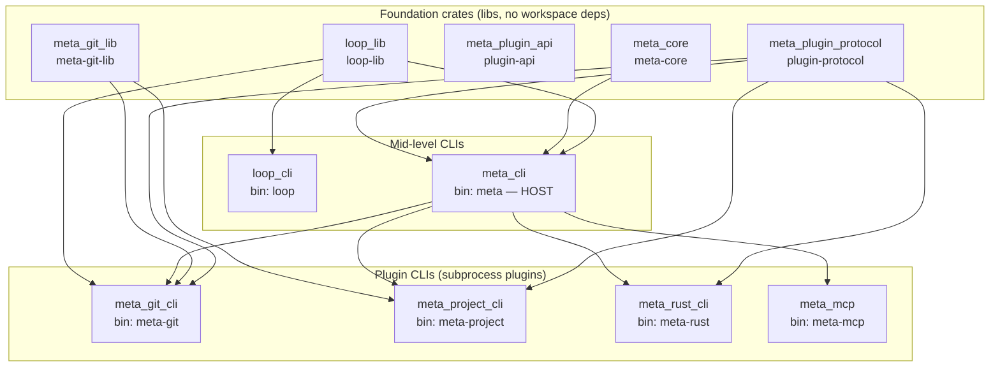
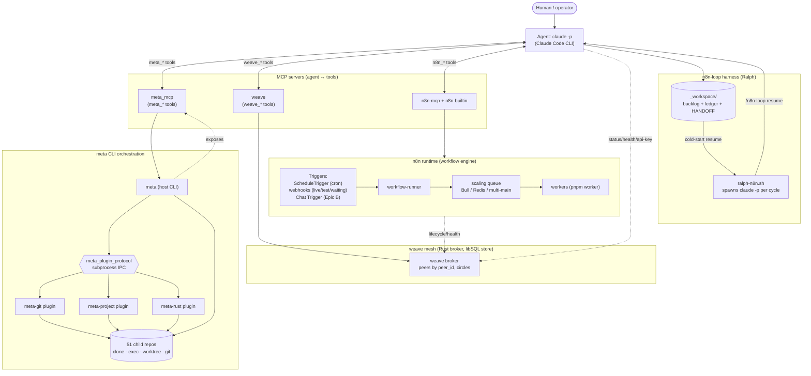
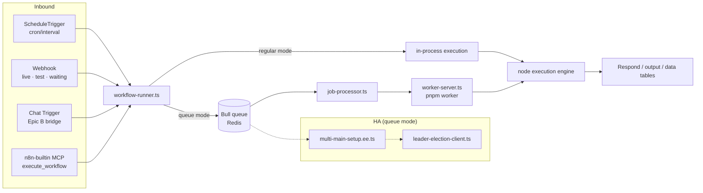

<!-- markdownlint-disable -->
# Meta workspace — cross-repo data-flow map

> Backlog item **A-4** (`n8n-loop`, Epic A — final item; completes the codebase map).
> Synthesized from `meta-inventory.md` (A-1 census + A-2 code-intel index) and `meta-codemap.md`
> (A-3 automation surfaces) — not re-derived. Generated 2026-06-05. Three views:
> (1) build/dependency spine, (2) runtime automation data-flow, (3) n8n internal execution flow.

## View 1 — Build / dependency spine (the meta CLI stack)
How the Rust crates depend on each other (`depends_on`/`provides` from `.meta.yaml`). Libraries are
consumed by CLIs; the plugin CLIs are spoken to by the `meta` host over a subprocess protocol.

## View 2 — Runtime automation data-flow (the whole workspace)
How the pieces actually talk at runtime: an agent (`claude -p`) drives the `meta` CLI (which fans out
to child repos via subprocess plugins) and the `n8n` runtime (via MCP); everything coordinates over
the **weave** mesh; the **n8n-loop** harness closes the loop by spawning fresh agents.

## View 3 — n8n internal execution flow (the runtime detail)
Inside the `n8n` repo (the largest, 48.6k symbols / 9.2k files): how a trigger becomes an execution.

## Connection legend (grounding)
| Edge | Mechanism | Source (codemap §) |
|------|-----------|--------------------|
| agent → meta | `meta` MCP server (`meta_mcp`) exposes `meta_build/exec/git_*/snapshot_*/…` | §2 |
| meta → plugins | subprocess IPC over `meta_plugin_protocol` (RUST_LOG inherited) | §1 |
| meta → child repos | clone / `meta exec` / `meta worktree` / `meta git` across the 51 repos | §1, inventory |
| agent ↔ agent/peers | weave mesh (`weave_send/inbox/peers/thread`) + repowire/broker front-ends | §2, §6 |
| agent → n8n | `n8n-mcp` (mgmt) + `n8n-builtin` (28 live workflow tools) | §2 |
| n8n trigger → execution | `workflow-runner.ts` → scaling queue (Bull/Redis) → workers | §4, §5 |
| harness → agent | `ralph-n8n.sh` spawns `claude -p "/n8n-loop resume"` per cycle | §3 |
| agent → durable state | `_workspace/` backlog + ledger + HANDOFF (git-committed) | this loop |

## Key data-flow facts (from the maps; do not re-derive)
- **51 repos** total → **42 code** (207,954 symbols / 326,955 call edges), **9 empty + 8 stub hubs**.
- **One nested meta repo** (`mcp_hub`, `meta:true`) hosts forked external MCP servers (e.g. n8n-mcp) —
  it is itself a meta-managed sub-workspace, so the `meta git update` recursion reaches into it.
- **The mesh is the spine of cross-agent coordination**: every harness (run-n8n, n8n-loop) reports
  lifecycle/health and hands off secrets (n8n API key, MCP bearer token) over weave, not over files.
- **n8n is both a runtime and an automation target**: the loop *runs* it (run-n8n) and *builds
  workflows on* it (workflow-ops via the two MCP surfaces). Epics B/C add new inbound surfaces
  (Chat Trigger bridge; visualization workflows) on top of this same engine.
- **`harness_hub`** holds the tailored upgrade kits (`upgrade-kits/n8n.md`) that defined this harness;
  it is a docs hub (0 code symbols), referenced by `n8n/CLAUDE.md`, not wired at runtime.

## Epic A — COMPLETE
- ✅ A-1 inventory · ✅ A-2 code-intel index (`meta-inventory.md`)
- ✅ A-3 automation surfaces (`meta-codemap.md`)
- ✅ **A-4 cross-repo data-flow map (this file)** → Epic A done.

**Next:** Epic B — Claude Code CLI ↔ n8n chat bridge. **B-1**: spec the bridge workflow
(`Chat Trigger → guard → Execute Command claude -p → Respond`), security guardrails first →
`.claude/specs/claude-n8n-chat-bridge.md`. View 2's `Chat Trigger (Epic B)` node and View 3's
`chat` inbound are the planned insertion points.
